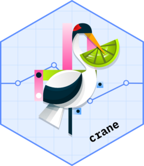

<!-- README.md is generated from README.Rmd. Please edit that file -->

```{r, include = FALSE}
knitr::opts_chunk$set(
  collapse = TRUE,
  comment = "#>",
  fig.path = "man/figures/README-",
  out.width = "100%"
)
```

# crane <a href="https://insightsengineering.github.io/crane/"></a>

<!-- badges: start -->
[](https://app.codecov.io/gh/insightsengineering/crane)
<!-- badges: end -->

The {crane} package provides supplementary functions to the {gtsummary} specifically for trial reporting in the pharmaceutical industry.

## Installation

You can install {crane} with the following code.  

``` r
install.packages("crane")
```

Install the development version with `pak::pak("insightsengineering/crane")`

## Example

This is a basic example which shows you how to solve a common problem:

```{r example}
library(crane)
theme_gtsummary_roche()

tbl <- trial |>
  tbl_roche_summary(by = trt, include = c(age, grade), nonmissing = "always")
```

```{r tbl_print_simple, include = FALSE}
# Had to manually save images in temp file, not sure if better way.
gt::gtsave(as_gt(tbl), file = "man/figures/README-tbl_print_simple-1.png")
```

```{r out.width = "40%", echo = FALSE}
knitr::include_graphics("man/figures/README-tbl_print_simple-1.png")
```

