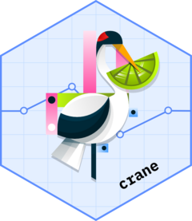

<!-- README.md is generated from README.Rmd. Please edit that file -->

# crane <a href="https://insightsengineering.github.io/crane/"></a>

<!-- badges: start -->

[](https://app.codecov.io/gh/insightsengineering/crane)
<!-- badges: end -->

The {crane} package provides supplementary functions to the {gtsummary}
specifically for trial reporting in the pharmaceutical industry.

## Installation

You can install {crane} with the following code.

``` r
install.packages("crane")
```

Install the development version with
`pak::pak("insightsengineering/crane")`

## Examples

The package exports a gtsummary theme for reporting at Roche. The theme
sets function defaults to meet reporting requirements at Roche, making
it simpler programmers to achieve the desired results without setting
too many arguments.

The package also exports a wrapper for the `gtsummary::tbl_summary()`
function with defaults more suited to reporting at Roche.

``` r
library(crane)
#> Loading required package: gtsummary
theme_gtsummary_roche()
#> Setting theme "Roche"

tbl <- trial |>
  tbl_roche_summary(by = trt, include = c(age, grade), nonmissing = "always")
```


The package also exports functions for Roche adverse event reporting,
functions for shift tables, and others.
