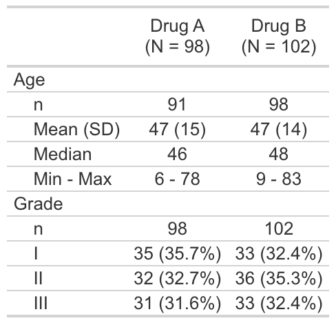

<!-- README.md is generated from README.Rmd. Please edit that file -->

# crane

<!-- badges: start -->

<!-- badges: end -->

The {crane} package provides supplementary functions to the {gtsummary}
specifically for trial reporting in the pharmecuetical industry.

## Installation

You can install the development version of crane from
[GitHub](https://github.com/) with:

``` r
# install.packages("pak")
pak::pak("insightsengineering/crane")
```

## Example

This is a basic example which shows you how to solve a common problem:

``` r
library(crane)
#> Loading required package: gtsummary
theme_gtsummary_roche()
#> Setting theme "Roche"

tbl <- tbl_demographics(trial, by = trt, include = c(age, grade))
#> Setting theme "Roche"
```



Each gtsummary table also contains the Analysis Results Dataset (ARD)

``` r
# extract ARD from table
gather_ard(tbl)
#> $tbl_summary
#> {cards} data frame: 66 x 12
#>    group1 group1_level variable variable_level stat_name stat_label  stat
#> 1     trt       Drug A    grade              I         n          n    35
#> 2     trt       Drug A    grade              I         N          N    98
#> 3     trt       Drug A    grade              I         p          % 0.357
#> 4     trt       Drug B    grade              I         n          n    33
#> 5     trt       Drug B    grade              I         N          N   102
#> 6     trt       Drug B    grade              I         p          % 0.324
#> 7     trt       Drug A    grade             II         n          n    32
#> 8     trt       Drug A    grade             II         N          N    98
#> 9     trt       Drug A    grade             II         p          % 0.327
#> 10    trt       Drug B    grade             II         n          n    36
#>    gts_column
#> 1      stat_1
#> 2      stat_1
#> 3      stat_1
#> 4      stat_2
#> 5      stat_2
#> 6      stat_2
#> 7      stat_1
#> 8      stat_1
#> 9      stat_1
#> 10     stat_2
#> ℹ 56 more rows
#> ℹ Use `print(n = ...)` to see more rows
#> ℹ 4 more variables: context, fmt_fn, warning, error
```
